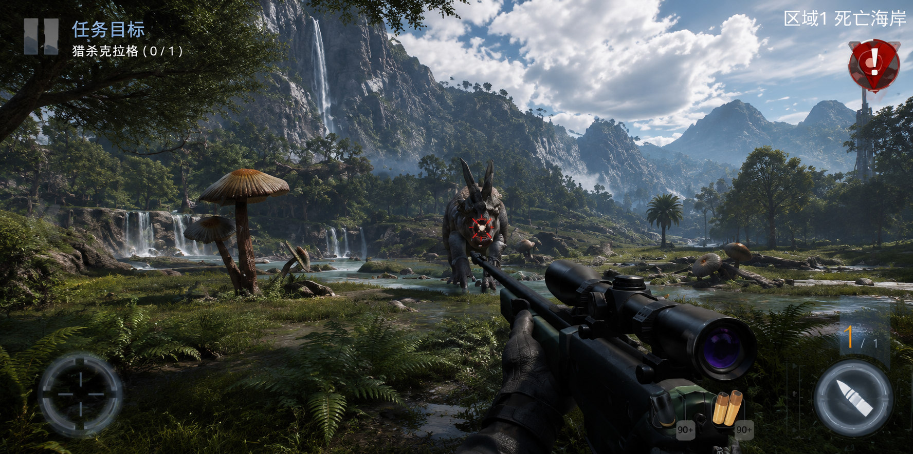
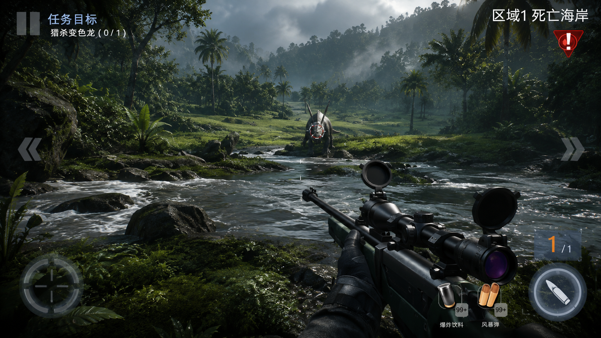
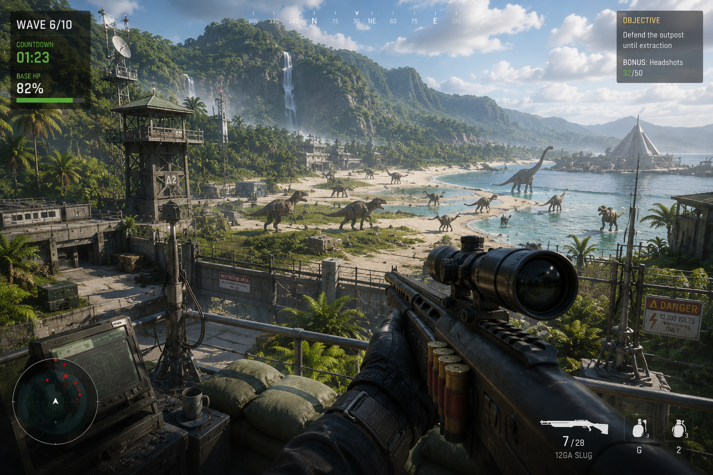
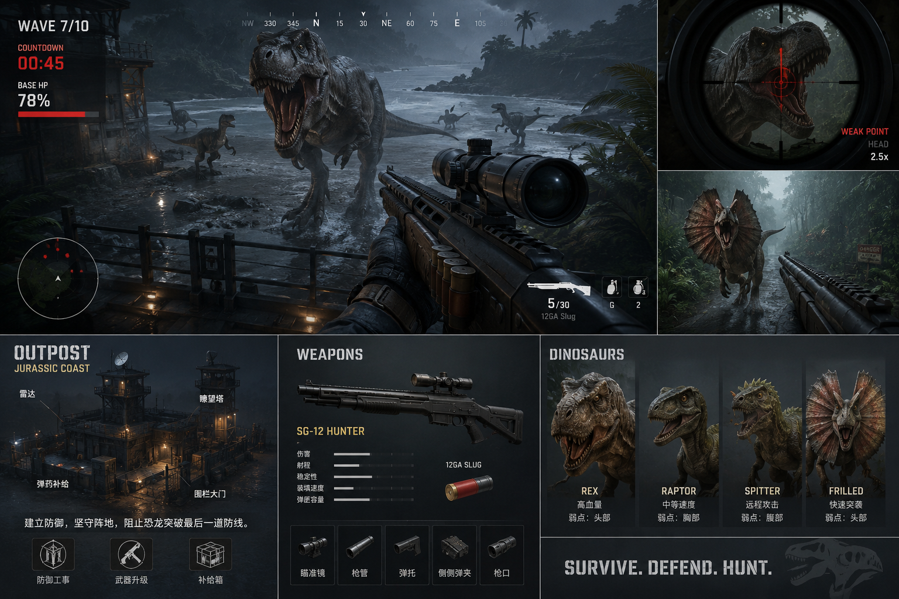

# Visual References

This document is the shared visual memory for Dino Outpost. The user provided four
reference images, with the current files stored in:

```text
public/reference-images/
```

Use the filenames listed below so future iterations can refer to them directly.

## Reference Files

| File | Source Description | Role |
| --- | --- | --- |
| `01-jungle-river-sniper.png` | Photoreal jungle river/coast scene with a sniper rifle foreground, dinosaur centered at distance, wet rocks, dense foliage, misty hills. | Main gameplay mood and environmental density |
| `02-bright-valley-waterfall-hunt.png` | Bright tropical valley with waterfalls, mountains, water, lush foreground plants, scoped rifle, dinosaur centered in lane. | High-end hero/gameplay composition and world beauty |
| `03-outpost-coast-defense-overview.png` | Bright coastal outpost defense view with watchtower, perimeter wall, radar laptop, many dinosaurs on the beach, objective panel, minimap, base HP, and first-person shotgun. | Outpost scale, defend-the-base gameplay, enemy density, strategic HUD |
| `04-product-direction-board.png` | Composite board showing rainy outpost combat, scope close-up, dinosaur types, weapons panel, outpost/base UI, and survival theme. | Overall product direction, content depth, UI modules |

## Primary Targets

These define the desired final look. When future work says "make it better", compare
against these rows first.

| Priority | Image | What To Learn From It | Apply To |
| --- | --- | --- | --- |
| 1 |  | The game should feel like a real, scenic dinosaur hunting valley: mountains, water, waterfalls, lush plants, readable dinosaur in the center, and a rifle grounded in first person. | Entry screen, first gameplay view, background composition |
| 2 |  | Dense wet jungle, river reflections, rocks, mist, and a believable hunting lane. The dinosaur is far but still readable. | Main gameplay environment, lighting, terrain, water/rock treatment |
| 3 |  | The outpost should feel defensible and useful: watchtower, railings, warning signage, radar, objective panel, beach lanes, and many dinosaur threats. | Outpost framing, mission HUD, enemy waves, strategic readable layout |
| 4 |  | The game should have more than one shooting view: outpost/base identity, weapon identity, dinosaur roster, scope inset, stormy combat mood, and survival-defense framing. | Product direction, progression UI, outpost framing, future content |

## Entry Screen References

The entry screen should feel like the game has already started. It should not read as a
generic marketing page.

| Image | Keep | Avoid |
| --- | --- | --- |
|  | Wide cinematic vista, strong natural light, rich depth, rifle in foreground, dinosaur centered as the promise of play. | Empty sky, flat ground, placeholder geometry, title over a weak scene. |
|  | Start from an elevated defensive position with base props, coastline depth, and visible incoming dinosaur pressure. | A menu that feels disconnected from the actual playable fantasy. |
|  | Strong title/product identity, outpost/base fantasy, survival-defense promise. | A pure tech-demo landing page or copy that talks about AI instead of the game. |

## Gameplay View References

Use these for the moment after pressing Start Mission.

| Image | Keep | Avoid |
| --- | --- | --- |
|  | Wet environment, layered foliage, foreground weapon, center threat, atmospheric hills. | Dry empty shooting range, giant flat horizon, dinosaur hidden by clutter. |
|  | Beautiful open lane with water and terrain depth; dinosaur reads clearly even at distance. | Overly dark scene where target and background share the same value. |
|  | Multiple dinosaurs can be visible if the lanes remain readable; base props should frame the foreground without blocking aim. | Cluttered props that hide enemies or make wave direction ambiguous. |

## Scope And Combat Feedback References

Use these for aiming, shooting, weak points, critical hits, hit markers, and elimination
feedback.

| Image | Keep | Avoid |
| --- | --- | --- |
|  | Scope close-up should feel cinematic and tactical; dinosaur face/weak point should be dramatic. | Generic FPS crosshair with no dinosaur-specific identity. |

## Product And Content Direction

The fourth reference is important because it is not just a screenshot. It describes the
future shape of the product.

| Area | Direction From `03-outpost-coast-defense-overview.png` and `04-product-direction-board.png` |
| --- | --- |
| Outpost | Add a recognizable base with towers, railings, warm lights, supplies, and defensive gates. |
| Weapons | Treat weapons as named gear with stats, ammo type, attachments, and visible first-person identity. |
| Dinosaurs | Move toward a roster: rex, raptor, spitter, frilled, heavy types, each with readable weak points. |
| HUD | Keep wave/base HP/minimap, but make it look like a survival-defense interface rather than a generic shooter overlay. |
| Tone | "Survive. Defend. Hunt." Wet, dangerous, cinematic, but still readable. |

## Anti-References

These are looks the game should not resemble.

| What Is Wrong | Rule For Future Iterations |
| --- | --- |
| Placeholder boxes, flat cylinders, empty lanes, and test-range terrain. | Do not ship visible placeholder shapes or empty center lanes. |
| UI that covers the dinosaur or makes the central target hard to read. | Combat HUD must support aiming, not fight it. |
| A dry open field with little water, little verticality, and little vegetation layering. | Add wet terrain, rocks, foliage, water, mist, and background elevation. |
| A weak first screen that looks like a prototype menu. | Entry screen must be a beautiful in-world scene with the game fantasy visible. |

## Implementation Rules Derived From The References

- The scene should move toward a lush tropical river/coast valley, not a dry grassland.
- Add water or wet reflective surfaces as soon as possible; the references are built around river, coast, mist, rain, or wet ground.
- Dinosaur should sit on the centerline and be readable at first glance.
- First-person weapon should feel like a real hunting weapon, not a blocky placeholder.
- Scope mode should be more dramatic: larger lens identity, stronger target lock, red weak-point brackets.
- Add more outpost identity over time: towers, lights, railings, supply crates, defensive gate.
- Keep HUD clean but purposeful: mission target, region/wave, objective panel, ammo, minimap, base HP, danger marker.
- Preserve readability over raw detail. Dense jungle is good only if the target remains clear.
